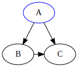
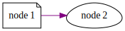
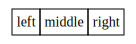
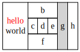
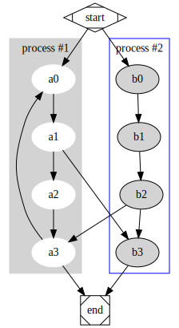

# Graphviz-node

A simple node wrapper for [Graphviz](http://www.graphviz.org/).  

> **NOTE:** This is a stripped down node implementation of [Graphviz](http://www.graphviz.org/). It was mainly written to support HTML-like nodes. For more bugs/issues or additional features please submit an issue.

## Documentation

To view docs run the following:

```bash
npm run docs
```

Js docs will automatically open in your browser.

You can also view node examples in the `examples/` directory.

## Prerequisite

- [Node](https://nodejs.org/en/)
- [Graphviz](http://www.graphviz.org/) - Make sure you have a working installation

## Installation

```
npm install graphviz-node --save
```

## Getting Started

```js
let {Graph, Digraph} = require("graphviz-node");

// Create new graph
let g = new Digraph();

// Create nodes
let a = g.addNode("A", {"color": "blue"});
let b = g.addNode("B");
let c = g.addNode("C");

// Add edge between the two nodes
let e1 = g.addEdge(a, b);
let e2 = g.addEdge(a, c);
let e3 = g.addEdge(b, c, {"constraint": false});

// Print dot file
let dotScript = g.toDot();
console.log(dotScript);

// Genereate the dot file
g.render("example");
```



## Basic Usage

The graphviz module provides two classes: `Graph` and `Digraph`. They create graph descriptions in the DOT language for **undirected** and **directed** graphs. All the following examples will be using `Digraph`. Both classes utilize the same API. To see all available methods, you can run JS docs using the command `npm run docs` in the root folder. 

Create a graph by instantiating a new `Graph` or `Digraph` object:

```js
let {Graph, Digraph} = require("graphviz-node");

// Create new graph
let g = new Digraph("Example");

// New directed Graph object
console.log(g);
```

The constructor allows to set the graph"s `name` for the DOT source and the rendered graph.

Add nodes and edges to the graph object using it"s `addNode()` and `addEdge()` methods.

```js
// Create nodes
let n1 = g.addNode("Node 1");
let n2 = g.addNode("Node 2");

// Add edge between the two nodes
let e1 = g.addEdge(n1, n2);
```
The `addNode()` method takes a name identifier as first argument and an optional attributes object. The `addEdge()` method takes the names of start and end node and an optional attributes object. For a litst of node/edge attributes (see Graphviz docs).

Check the generated source code:

```js
console.log(g.toDot());
```

Use the `render()` method to save the source code and render it with the default layout program (dot, see below for using other layout commands).

```js
g.render("test-output");
```

### Styling

Use the `set()`, `setNodesAttributes()` and `setEdgesAttributes()` methods to change the default appearance of your graph, nodes, and edges.

```js
let graphAttributes = {
    "rankdir":"LR",
    "nodesep":"0.5",
    "ranksep": "1",
    "labeljust":"l"
};

let nodesAttributes = {
    "shape": "note",
    "margin": ".2",
    "style": "filled",
    "fillcolor": "#999999",
    "fontcolor": "white"
}

let edgesAttributes = {
    "style": "dotted"
}

// Create new graph
let g = new Digraph();

// Set graph attributes
g.set(graphAttributes);
g.setNodesAttributes(nodesAttributes);
g.setEdgesAttributes(edgesAttributes);

console.log(g.toDot());
```

### Attributes

To directly add attritbute statements (affecting all following graph, node, or edge items within the same graph, use `set()` method with the target or pass an optional attributes object on declaration.

A full list of node, Eege, and graph attributes can be found here: http://www.graphviz.org/doc/info/attrs.html

**Node Attributes**

```js
// Option 1
let attributes = {
    "shape": "note",
    "margin": ".2",
    "style": "filled",
    "fillcolor": "#999999",
    "fontcolor": "white"
}

let n1 = g.addNode("node 1", attributes);

// Option 2
let n1 = g.addNode("node 1");
n1.set({"shape": "note"});
```

**Edge Attributes**

```js
// Option 1
let attributes = {
    "style": "dotted",
    "color": "orange"
}

let e1 = g.addEdge("1", "2", attributes);

// Option 2
let e1 = g.addEdge("1", "2");
e1.set({"style": "dotted"});
```

**Example Attributes**

```js
// Create new graph
let g = new Digraph();
g.set({"rankdir": "LR"});

let n1 = g.addNode("node 1");
n1.set({"shape": "note"});

let n2 = g.addNode("node 2");
n2.set({"shape": "egg"});

let e1 = g.addEdge(n1, n2);
e1.set({"color": "purple"});

console.log(g.toDot());
```



## HTML Nodes

HTML nodes are the same as regular nodes with embedded HTML in the label attribute. This library supports the ability to create HTML-like nodes using special methods to help build the HTML table syntax automatically.

The HTML node class `extends` the Node class with the addition of specific methods to build a table with rows for the node"s label.

**Example 1**

The `addRow()` methods allows for an array of objects that define the `<td>` element data and attributes. The following example creates an HTML table with one row (`<tr>`) and three columns (`<td>`).

```js
// Create new graph
let g = new Digraph();

let h1 = g.addHTMLNode("h1", {"shape":"none"});
h1.setTableAttributes({"border":"0", "cellborder":"1", "cellspacing":"0", "cellpadding": "4"});
h1.addRow([
 {
     "data": "left",
     "attributes": {"port": "port0"}
 },
 {
     "data": "middle",
     "attributes": {"port": "port1"}
 },
 {
     "data": "right",
     "attributes": {"port": "port2"}
 }
]);

console.log(g.toDot());

// dot syntax that gets generated...
digraph {
  "h1" [shape=none, label=<<table border="0" cellborder="1" cellspacing="0" cellpadding="4"><tr><td port="port0">left</td><td port="port1">middle</td><td port="port2">right</td></tr></table>>];
}
```



**Example 2**

```js
// Create new graph
let g = new Digraph("html");

let h1 = g.addHTMLNode("abc", {"shape":"none", "margin":"0"});
h1.setTableAttributes({"border":"0", "cellborder":"1", "cellspacing":"0", "cellpadding":"4"});
h1.addRow([{"data":"<FONT COLOR="red">hello</FONT><BR/>world","attributes":{"rowspan":"3"}}, {"data":"b", "attributes":{"colspan":"3"}}, {"data":"g", "attributes":{"rowspan":"3", "bgcolor":"lightgrey"}}, {"data":"h", "attributes":{"rowspan":"3"}}]);
h1.addRow([{"data":"c","attributes":{}}, {"data":"d", "attributes":{"port":"here"}}, {"data":"e", "attributes":{}}]);
h1.addRow([{"data":"f","attributes":{"colspan":"3"}}]);

console.log(g.toDot());

// Dot syntax that gets generated...
digraph "html" {
  "abc" [shape=none, margin=0, label=<<table border="0" cellborder="1" cellspacing="0" cellpadding="4"><tr><td rowspan="3"><FONT COLOR="red">hello</FONT><BR/>world</td><td colspan="3">b</td><td rowspan="3" bgcolor="lightgrey">g</td><td rowspan="3">h</td></tr><tr><td>c</td><td port="here">d</td><td>e</td></tr><tr><td colspan="3">f</td></tr></table>>];
}
```



## Subgraphs & Clusters

Graph and Digraph objects have an `addSubgraph()` method for adding a subgraph to a graph. This is done by creating a ready-made graph object of the same kind as the only argument (whose content is added as a subgraph).

> **Note:** If the name of a subgraph begins with "cluster" (all lowercase) the layout engine will treat it as a special cluster subgraph (example). Also see the Subgraphs and Clusters section of [the DOT](https://www.graphviz.org/doc/info/lang.html) language documentation.

```js
// Create new graph
let g = new Digraph("Subgraph Example");

// Create parent nodes
let start = g.addNode("start", {"shape": "Mdiamond"});
let end = g.addNode("end", {"shape": "Msquare"});
let a0 = g.addNode("a0");
let a1 = g.addNode("a1");
let a2 = g.addNode("a2");
let a3 = g.addNode("a3");
let b0 = g.addNode("b0");
let b1 = g.addNode("b1");
let b2 = g.addNode("b2");
let b3 = g.addNode("b3");

// Create edges
g.addEdge(start, a0);
g.addEdge(start, b0);
g.addEdge(a1, b3);
g.addEdge(b2, a3);
g.addEdge(a3, a0);
g.addEdge(a3, end);
g.addEdge(b3, end);

// Create graph and set nodes and edges
let c0 = new Digraph("cluster0");
c0.set({"style":"filled", "color":"lightgrey", "label": "process #1"});
c0.setNodesAttributes({"style":"filled", "color":"white"});
c0.addEdge(a0, a1);
c0.addEdge(a1, a2);
c0.addEdge(a2, a3);

// Create graph and set nodes and edges
let c1 = new Digraph("cluster1");
c1.set({"color":"blue", "label":"process #2"});
c1.setNodesAttributes({"style":"filled"});
c1.addEdge(b0, b1);
c1.addEdge(b1, b2);
c1.addEdge(b2, b3);

// Associate subgraphs
g.addSubgraph(c0);
g.addSubgraph(c1);

// Print dot file
console.log(g.toDot());

// Dot sytanx that gets generated...
digraph "Subgraph Example" {
  subgraph "cluster0" {
    graph [style="filled", color="lightgrey", label="process #1"];
    node [style="filled", color="white"];
    "a0" -> "a1";
    "a1" -> "a2";
    "a2" -> "a3";
  }
  subgraph "cluster1" {
    graph [color="blue", label="process #2"];
    node [style="filled"];
    "b0" -> "b1";
    "b1" -> "b2";
    "b2" -> "b3";
  }
  "start" [shape=Mdiamond];
  "end" [shape=Msquare];
  "a0";
  "a1";
  "a2";
  "a3";
  "b0";
  "b1";
  "b2";
  "b3";
  "start" -> "a0";
  "start" -> "b0";
  "a1" -> "b3";
  "b2" -> "a3";
  "a3" -> "a0";
  "a3" -> "end";
  "b3" -> "end";
}
```



## Attribution

This library was heavily inspired by https://github.com/glejeune/node-graphviz. Code was rewritten to support a stripped a specific use-case and *may* differ in syntax. If this library does not fit your use-case, please consider using glejeune"s implementation.
